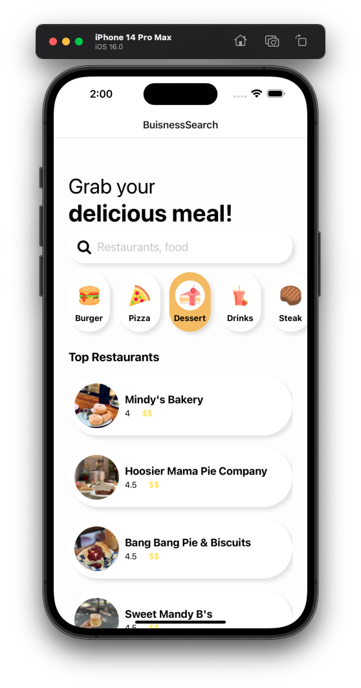
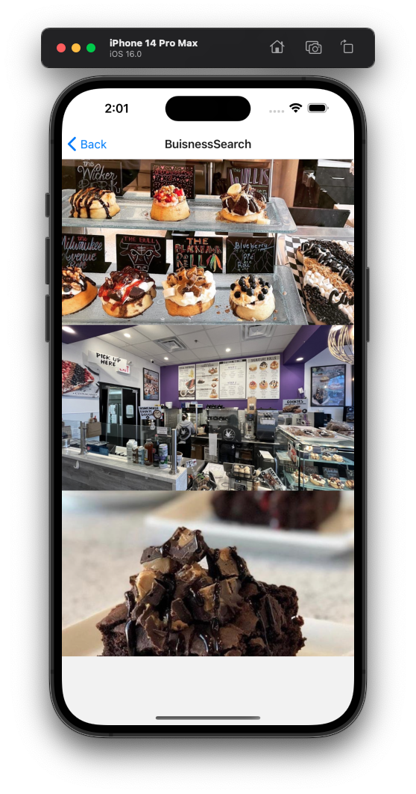
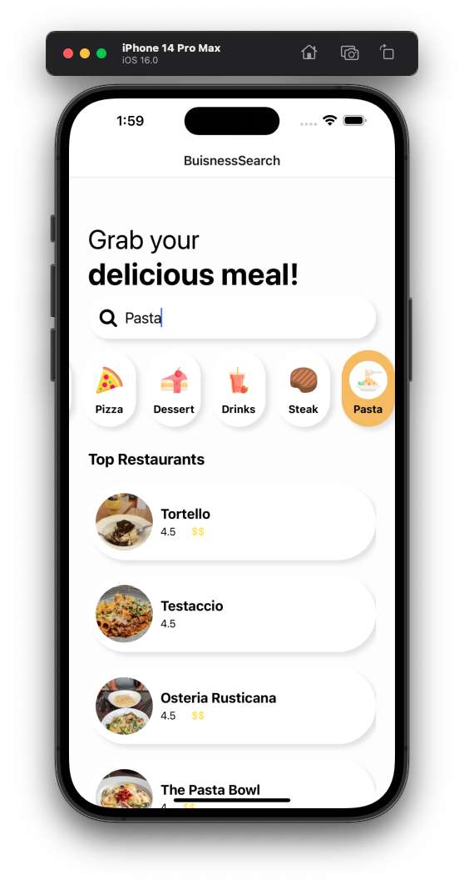
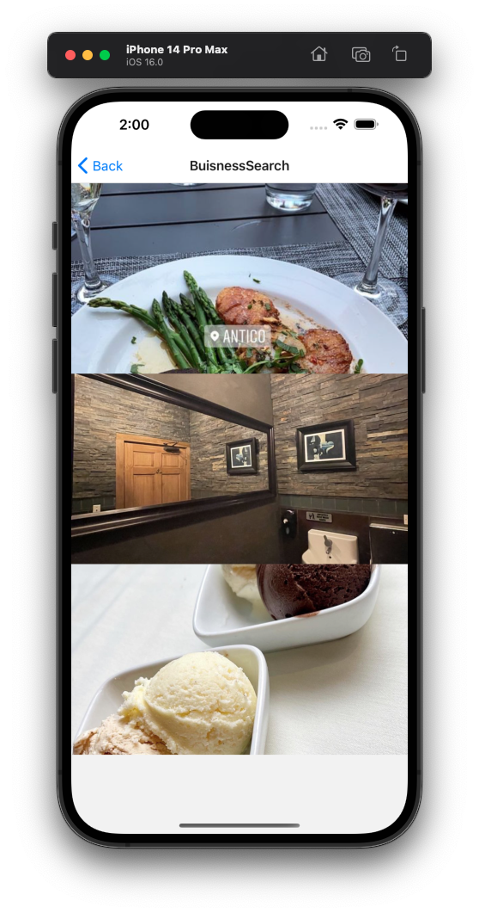

# Restaurant Search - React Native

A small project created with [Laith Academy](https://www.youtube.com/watch?v=1oYw1uwDZb8) to learn/practice React Native knowledge.
The app allows the user to search the category of the food and returns the list of restaurants from that category in Chicago, USA (randomly picked city). User then can view 3 photos from a chosen restaurant in a separate screen. The App uses API from [Yelp](https://fusion.yelp.com/).

